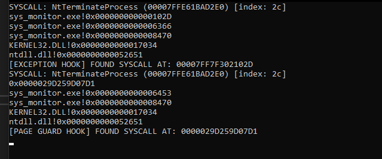

# hidden syscall monitoring
 monitors hidden syscalls called from call of duty anticheat via exception hooking

# poc
the anticheat does not call NtAllocateVirtualMemory for these, they have a large spot in the .text section and they call NtProtectVirtualMemory with PAGE_EXECUTE_READWRITE on it.

# example 
```cpp
int main(int argc, char** argv)
{
	sys_monitor::init();

	while (true)
	{
		const auto syassasd = (unsigned __int64)GetProcAddress(LoadLibraryA("ntdll"), "NtTerminateProcess");
		const auto spoof_start = (unsigned __int64)GetProcAddress(LoadLibraryA("ntdll"), "NtOpenFile");
		syscall_spoofer::spoof_syscall(spoof_start, syassasd, (HANDLE)-1, 1337);

		Sleep(5000);
	}

	getchar();
	return 0;
}  
```

# output

